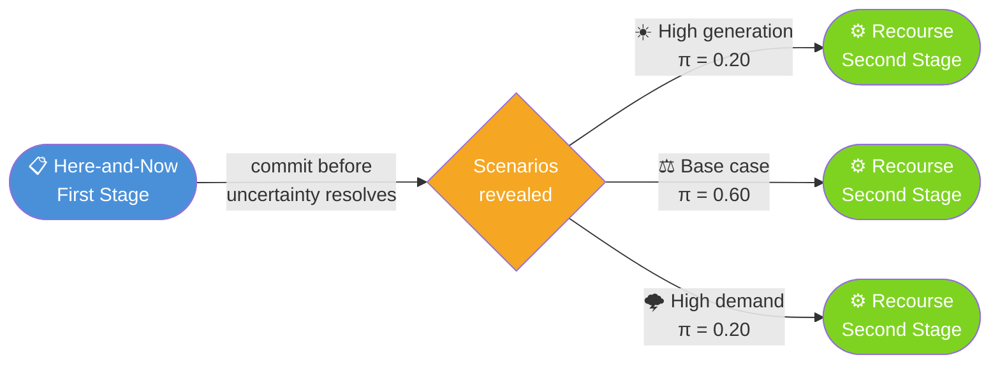

# Stochastic Energy Management for Residential Energy Communities


> *Undergraduate research project (Iniciação Científica) — CPTEn / FEEC / UNICAMP*

---

## What This Project Does

Solar generation peaks at noon. Electricity prices peak in the evening. Demand is unpredictable.

This repository implements a **two-stage stochastic MILP** that decides — before the day unfolds — how to operate a residential energy community's battery storage so that expected energy costs are minimized across all plausible scenarios of generation and demand.

Rather than optimizing for a single forecast and hoping it holds, the model hedges: it commits to a storage schedule robust enough to perform well whether tomorrow is sunny, cloudy, high-demand or low-demand.

---

## System Architecture

```
                    ☀️  PV Generation (uncertain)
                           │
              ┌────────────▼────────────┐
              │                         │
        🔋 Battery Storage         🏠 Demand (uncertain)
              │                         │
              └────────────┬────────────┘
                           │
                    ⚡ Grid (buy / sell)
```

The community can draw from the grid, export surplus, and charge or discharge the battery — all subject to physical constraints and time-of-use tariffs.

---

## Two-Stage Stochastic Structure



| Stage | Decisions | Timing |
|-------|-----------|--------|
| **First** | Battery charge/discharge schedule, storage sizing | Before uncertainty is revealed |
| **Second** | Grid power flows (buy/sell), adjusted per scenario | After scenario is known |

---

## Key Performance Metric: VSS

The **Value of the Stochastic Solution** measures how much better the stochastic model performs compared to naively optimizing for a single average scenario:

$$\text{VSS} = z^{EV} - z^{RP}$$

where $z^{RP}$ is the optimal expected cost under the stochastic model and $z^{EV}$ is the cost of the deterministic (expected-value) solution when applied to all scenarios. A higher VSS means uncertainty matters more and stochastic modeling adds more value.

---

## Repository Structure

```
stochastic-energy-opt/
└── program/
    ├── main.py               # Entry point
    ├── data/
    │   └── inputs.py         # Load profiles, PV data, tariffs, scenarios
    ├── model/
    │   └── smart_home.py     # SmartHomeStochastic class (build + solve)
    └── analysis/
        └── plot.py           # Result visualization
```

---

## Installation

No `requirements.txt` needed — install dependencies directly:

```bash
pip install pyomo pandas matplotlib highspy
```

| Package | Purpose |
|---------|---------|
| `pyomo` | Algebraic modeling language for the MILP |
| `pandas` | Result collection and tabular output |
| `matplotlib` | Operational dispatch plots |
| `highspy` | Open-source MILP solver (HiGHS Python interface) |

> **Optional:** If you have a Gurobi license, replace `SolverFactory('highs')` with `SolverFactory('gurobi')` in `model/smart_home.py` for faster solves on larger instances.

---

## Running the Model

```bash
cd program
python main.py
```

The solver will print the optimal expected daily cost and a per-scenario dispatch table, then display the operational plots.

---

## Scenario Design

Three scenarios capture the joint uncertainty in PV generation and electricity demand:

| Scenario | Demand | PV Generation | Probability |
|----------|--------|--------------|-------------|
| Base | Nominal | Nominal | 60% |
| High demand | +50% | −50% | 20% |
| High generation | −50% | +50% | 20% |

---

## Mathematical Formulation (Compact)

**Objective** — minimize expected daily cost:

$$\min \; c_{\text{BESS}} \cdot E^{\text{cap}} + \sum_{s \in S} \pi_s \sum_{t \in T} \left[ \lambda_t \cdot P^{\text{buy}}_{s,t} - 0.7\lambda_t \cdot P^{\text{sell}}_{s,t} \right]$$

**Power balance** (per scenario, per hour):

$$P^{\text{buy}}_{s,t} + P^{\text{PV}}_{s,t} + P^{\text{dis}}_t = P^{\text{sell}}_{s,t} + P^{\text{dem}}_{s,t} + P^{\text{ch}}_t$$

**Battery state of energy:**

$$E_t = E_{t-1} + \eta \cdot P^{\text{ch}}_t - \frac{P^{\text{dis}}_t}{\eta} - \beta \cdot E_{t-1}$$

**Mutual exclusion** (no simultaneous charge and discharge):

$$P^{\text{ch}}_t \leq \delta_t \cdot M, \quad P^{\text{dis}}_t \leq (1 - \delta_t) \cdot M, \quad \delta_t \in \{0,1\}$$

---

## Research Context

This project is developed as part of an undergraduate research grant (*Iniciação Científica*) funded by **FAPESP**, within the Center for Energy Planning and Technology (**CPTEn**), at the School of Electrical and Computer Engineering (**FEEC**), University of Campinas (**UNICAMP**), under the supervision of **Prof. Dr. Marcos J. Rider Flores (DSE/FEEC/UNICAMP)**.

A research internship (**BEPE/FAPESP**) at the **University of Melbourne** under **Prof. Luis Ochoa** is associated with this project.

---

## License

MIT — see `LICENSE` for details.