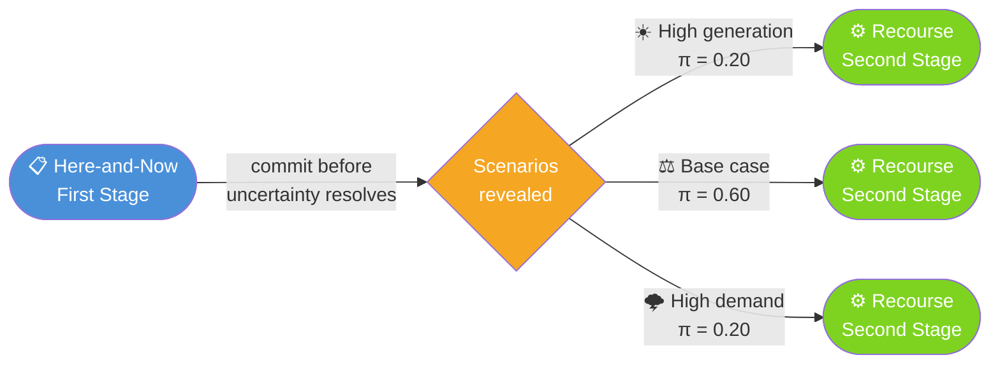

# Stochastic Energy Management for Residential Energy Communities


> *Undergraduate research project (Iniciação Científica) — CPTEn / FEEC / UNICAMP*

---

## What This Project Does

Solar generation peaks at noon. Electricity prices peak in the evening. Demand is unpredictable. Grid outages happen.

This repository implements a **two-stage stochastic MILP** that decides — before the day unfolds — the optimal sizing of a residential solar PV system and battery storage (BESS), minimizing the net present value (NPV) of total investment and operational costs over a 25-year horizon across all plausible scenarios of generation, demand, and grid availability.

Rather than optimizing for a single forecast, the model hedges: it commits to sizing decisions robust enough to perform well whether tomorrow is sunny, cloudy, high-demand, or affected by a blackout.

---

## Two-Stage Stochastic Structure


```mermaid
flowchart LR
    A([📋 Here-and-Now\nFirst Stage]) -->|commit before\nuncertainty resolves| B{Scenarios\nrevealed}
    B -->|☀️ High generation\nπ = 0.20| C([⚙️ Recourse\nSecond Stage])
    B -->|⚖️ Base case\nπ = 0.60| D([⚙️ Recourse\nSecond Stage])
    B -->|🌩️ High demand\nπ = 0.20| E([⚙️ Recourse\nSecond Stage])

    style A fill:#4a90d9,color:#fff
    style B fill:#f5a623,color:#fff
    style C fill:#7ed321,color:#fff
    style D fill:#7ed321,color:#fff
    style E fill:#7ed321,color:#fff
```

| Stage | Decisions | Timing |
|-------|-----------|--------|
| **First** | PV system size (`PV_Pmax`), BESS capacity (`BESS_capacity`), initial state of energy | Before uncertainty is revealed |
| **Second** | Grid power flows (buy/sell), BESS charge/discharge dispatch per scenario and blackout window | After scenario and outage are known |

---

## Scenario Design

Three scenarios capture the joint uncertainty in PV generation and electricity demand:

| Scenario | Demand | PV Generation | Probability |
|----------|--------|--------------|-------------|
| Base | Nominal | Nominal | 60% |
| High demand | +50% | −50% | 20% |
| High generation | −50% | +50% | 20% |

---

## Blackout Modeling

Grid outages are modeled as an independent, uniformly distributed event across 8 possible start times (every 3 hours), each lasting 3 hours. The total annual outage probability is 5%.

During a blackout window, both `Pgrid_buy` and `Pgrid_sell` are forced to zero, requiring the BESS to fully cover local demand from storage alone.

| Parameter | Value |
|-----------|-------|
| Total probability | 5% |
| Start times | 0, 3, 6, 9, 12, 15, 18, 21 h |
| Duration | 3 hours |
| Distribution | Uniform across start times |

---

## Mathematical Formulation

**Objective** — minimize NPV of investment and operational costs over 25 years:

$$\min \; C_{\text{BESS}} \cdot E^{\text{cap}} + C_{\text{PV}} \cdot P^{\text{PV}}_{\max} + \sum_{y=0}^{24} \frac{\text{OPEX}}{(1+r)^y}$$

where the annual OPEX is the expected daily dispatch cost scaled to 365 days:

$$\text{OPEX} = 365 \sum_{b \in B} \sum_{s \in S} \sum_{t \in T} \pi_b \cdot \pi_s \left[ \lambda_t \cdot P^{\text{buy}}_{s,t,b} - 0.7\lambda_t \cdot P^{\text{sell}}_{s,t,b} \right]$$

**Power balance** (per scenario $s$, hour $t$, blackout window $b$):

$$P^{\text{buy}}_{s,t,b} + P^{\text{PV}}_{s,t} \cdot P^{\text{PV}}_{\max} + P^{\text{dis}}_{s,t,b} = P^{\text{sell}}_{s,t,b} + P^{\text{dem}}_{s,t} + P^{\text{ch}}_{s,t,b}$$

**Battery state of energy:**

$$E_{s,t,b} = E_{s,t-1,b} + \eta \cdot P^{\text{ch}}_{s,t,b} - \frac{P^{\text{dis}}_{s,t,b}}{\eta} - \beta \cdot E_{s,t,b}$$

**Mutual exclusion** (no simultaneous charge and discharge):

$$P^{\text{ch}}_{s,t,b} \leq \delta_{s,t,b} \cdot M, \quad P^{\text{dis}}_{s,t,b} \leq (1 - \delta_{s,t,b}) \cdot M, \quad \delta_{s,t,b} \in \{0,1\}$$

**Blackout constraints:**

$$P^{\text{buy}}_{s,t,b} = 0 \quad \text{and} \quad P^{\text{sell}}_{s,t,b} = 0 \quad \forall\, t \in [b,\, b + \text{dur})$$

---

## Key Parameters

| Parameter | Value | Description |
|-----------|-------|-------------|
| `eff` | 0.90 | Round-trip efficiency (charge and discharge) |
| `beta` | 0.01 | Self-discharge rate per hour |
| `CAPEX_BESS` | 2500 BRL/kWh | Battery investment cost |
| `CAPEX_PV` | 1200 BRL/kWp | PV investment cost |
| `r` | 5% | Discount rate |
| `horizon` | 25 years | Project lifetime |
| `Pmax_grid` | 20 kW | Grid connection limit |
| C-rate limit | 0.5 | `BESS_Pmax ≤ 0.5 × BESS_capacity` |

---

## Project Structure

```
stochastic-energy-opt/
├── v2.1.py            # Main model — data, SmartHomeStochastic class, entry point
├── requirements.txt   # Python dependencies
├── LICENSE
└── README.md
```

`v2.1.py` is organized in three sections:

- **Data** 